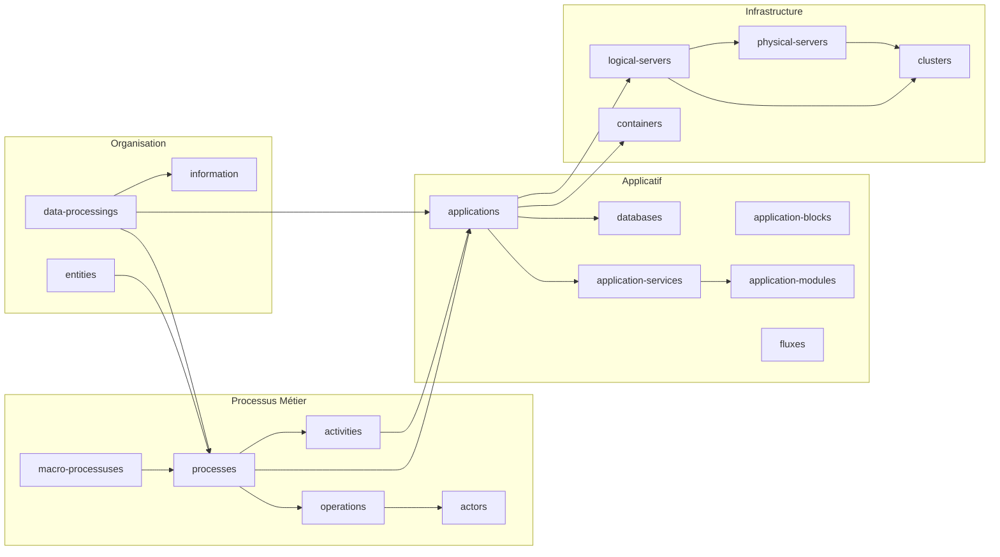

# Annexe A — Mapping des Données Mercator CMDB
*Généré à partir de l'analyse de `dump_standard.json` et `mercator_backup_dump_v4.py`*

---

## A.1 Vue d'ensemble — Endpoints et Volumes (données de référence)

| Endpoint | Objets (dump) | Statut |
|----------|:---:|--------|
| `data-processings` | 15 | ✅ Actif |
| `security-controls` | 5 | ✅ Actif |
| `entities` | 6 | ✅ Actif |
| `relations` | 5 | ✅ Actif |
| `macro-processuses` | 2 | ✅ Actif |
| `processes` | 6 | ✅ Actif |
| `activities` | 8 | ✅ Actif |
| `operations` | 14 | ✅ Actif |
| `actors` | 6 | ✅ Actif |
| `information` | 1 | ✅ Actif |
| `application-blocks` | 3 | ✅ Actif |
| `applications` | 7 | ✅ Actif |
| `application-services` | 1 | ✅ Actif |
| `application-modules` | 1 | ✅ Actif |
| `databases` | 2 | ✅ Actif |
| `fluxes` | 1 | ✅ Actif |
| `zone-admins` | 1 | ✅ Actif |
| `annuaires` | 1 | ✅ Actif |
| `forest-ads` | 2 | ✅ Actif |
| `domaine-ads` | 2 | ✅ Actif |
| `admin-users` | 5 | ✅ Actif |
| `networks` | 3 | ✅ Actif |
| `subnetworks` | 4 | ✅ Actif |
| `network-switches` | 2 | ✅ Actif |
| `clusters` | 2 | ✅ Actif |
| `logical-servers` | 9 | ✅ Actif |
| `containers` | 1 | ✅ Actif |
| `vlans` | 4 | ✅ Actif |
| `sites` | 1 | ✅ Actif |
| `buildings` | 6 | ✅ Actif |
| `bays` | 7 | ✅ Actif |
| `physical-servers` | 8 | ✅ Actif |
| `physical-switches` | 2 | ✅ Actif |
| `lans` | 1 | ✅ Actif |
| `tasks` | 0 | ⚪ Vide |
| `gateways` | 0 | ⚪ Vide |
| `external-connected-entities` | 0 | ⚪ Vide |
| `routers` | 0 | ⚪ Vide |
| `security-devices` | 0 | ⚪ Vide |
| `logical-flows` | 0 | ⚪ Vide |
| `certificates` | 0 | ⚪ Vide |
| `workstations` | 0 | ⚪ Vide |
| `storage-devices` | 0 | ⚪ Vide |
| `peripherals` | 0 | ⚪ Vide |
| `phones` | 0 | ⚪ Vide |
| `physical-routers` | 0 | ⚪ Vide |
| `wifi-terminals` | 0 | ⚪ Vide |
| `physical-security-devices` | 0 | ⚪ Vide |
| `physical-links` | 0 | ⚪ Vide |
| `wans` | 0 | ⚪ Vide |
| `mans` | 0 | ⚪ Vide |

---

## A.2 Mapping par Domaine Métier

### Domaine 1 — Sécurité & Conformité (RGPD / BIA)

#### `data-processings` — Traitements de données
Champs : `id`, `name`, `description`, `responsible`, `purpose`, `categories`, `recipients`, `transfert`, `retention`, `controls`, `legal_basis`, `lawfulness`, `lawfulness_legitimate_interest`, `lawfulness_public_interest`, `lawfulness_vital_interest`, `lawfulness_legal_obligation`, `lawfulness_contract`, `lawfulness_consent`, `created_at`, `updated_at`

Relations : `processes`, `informations`, `applications`

> **Usage reporting :** Registre RGPD, base légale des traitements, durées de rétention.

---

#### `security-controls` — Contrôles de sécurité
Champs : `id`, `name`, `description`, `created_at`, `updated_at`

---

#### `information` — Informations sensibles
Champs : `id`, `name`, `description`, `owner`, `administrator`, `storage`, `sensitivity`, `constraints`, `retention`, `security_need_c`, `security_need_i`, `security_need_a`, `security_need_t`, `security_need_auth`

> **Usage reporting :** Cartographie des données sensibles, niveaux de confidentialité (CIAT).

---

#### `relations` — Relations entre entités
Champs : `id`, `name`, `type`, `importance`, `description`, `source_id`, `destination_id`, `active`, `start_date`, `end_date`, `security_need_c`, `security_need_i`, `security_need_a`, `security_need_t`, `security_need_auth`

---

### Domaine 2 — Processus Métier

#### `macro-processuses` — Macro-processus
Champs : `id`, `name`, `description`, `io_elements`, `owner`, `security_need_c`, `security_need_i`, `security_need_a`, `security_need_t`, `security_need_auth`

---

#### `processes` — Processus
Champs : `id`, `name`, `description`, `owner`, `in_out`, `macroprocess_id`, `security_need_c`, `security_need_i`, `security_need_a`, `security_need_t`, `security_need_auth`

Relations : `activities`, `entities`, `informations`, `applications`, `operations`

---

#### `activities` — Activités ⭐ Clé BIA
Champs : `id`, `name`, `description`, `drp`, `drp_link`, **`recovery_time_objective`**, **`maximum_tolerable_downtime`**, **`recovery_point_objective`**, **`maximum_tolerable_data_loss`**

> **Usage reporting BIA :** Cet endpoint contient les données RTO/RPO natifs de Mercator. C'est la source principale pour les rapports de continuité d'activité.

---

#### `operations` — Opérations
Champs : `id`, `name`, `description`, `process_id`

Relations : `actors`, `tasks`, `activities`

---

#### `actors` — Acteurs
Champs : `id`, `name`, `nature`, `type`, `contact`

---

### Domaine 3 — Entités & Organisation

#### `entities` — Entités organisationnelles
Champs : `id`, `name`, `description`, `security_level`, `contact_point`, `is_external`, `entity_type`, `reference`, `parent_entity_id`

> Supporte une hiérarchie via `parent_entity_id`.

---

### Domaine 4 — Applicatif

#### `applications` — Applications ⭐ Endpoint central
Champs : `id`, `name`, `description`, `type`, `technology`, `version`, `responsible`, `functional_referent`, `editor`, `vendor`, `product`, `external`, `users`, `documentation`, `install_date`, `update_date`, `patching_frequency`, `next_update`, **`rto`**, **`rpo`**, `security_need_c`, `security_need_i`, `security_need_a`, `security_need_t`, `security_need_auth`, `entity_resp_id`, `application_block_id`

Relations : `entities`, `processes`, `services`, `databases`, `logical_servers`, `activities`, `containers`

> **Usage reporting :** Inventaire applicatif complet, RTO/RPO par application, cartographie des dépendances, suivi des versions et patchs.

---

#### `application-blocks` — Blocs applicatifs
Champs : `id`, `name`, `description`, `responsible`

---

#### `application-services` — Services applicatifs
Champs : `id`, `name`, `description`, `exposition`

Relations : `modules`, `applications`

---

#### `application-modules` — Modules
Champs : `id`, `name`, `description`, `vendor`, `product`, `version`

Relations : `application_services`

---

#### `databases` — Bases de données
Champs : `id`, `name`, `description`, `type`, `responsible`, `external`, `security_need_c`, `security_need_i`, `security_need_a`, `security_need_t`, `security_need_auth`, `entity_resp_id`

---

#### `fluxes` — Flux applicatifs
Champs : `id`, `name`, `description`, `nature`, `crypted`, `bidirectional`, `application_source_id`, `service_source_id`, `module_source_id`, `database_source_id`, `application_dest_id`, `service_dest_id`, `module_dest_id`, `database_dest_id`

> **Usage reporting :** Cartographie des flux de données, audit des communications inter-applicatives.

---

### Domaine 5 — Administration & Annuaire

#### `zone-admins` — Zones d'administration
Champs : `id`, `name`, `description`

#### `annuaires` — Annuaires
Champs : `id`, `name`, `description`, `solution`, `zone_admin_id`

#### `forest-ads` — Forêts Active Directory
Champs : `id`, `name`, `description`, `zone_admin_id`

Relations : `domaines`

#### `domaine-ads` — Domaines Active Directory
Champs : `id`, `name`, `description`, `domain_ctrl_cnt`, `user_count`, `machine_count`, `relation_inter_domaine`

#### `admin-users` — Utilisateurs administrateurs
Champs : `id`, `firstname`, `lastname`, `type`, `description`, `domain_id`, `user_id`

---

### Domaine 6 — Réseau Logique

#### `networks` — Réseaux
Champs : `id`, `name`, `description`, `protocol_type`, `responsible`, `responsible_sec`, `security_need_c`, `security_need_i`, `security_need_a`, `security_need_t`, `security_need_auth`

#### `subnetworks` — Sous-réseaux
Champs : `id`, `name`, `description`, `address`, `ip_allocation_type`, `dmz`, `wifi`, `zone`, `default_gateway`, `network_id`, `vlan_id`, `gateway_id`

#### `logical-servers` — Serveurs logiques
Champs : `id`, `name`, `description`, `net_services`, `configuration`, `operating_system`, `address_ip`, `cpu`, `memory`, `disk`, `disk_used`, `environment`, `type`, `active`, `install_date`, `update_date`, `patching_frequency`, `next_update`, `cluster_id`, `domain_id`

Relations : `physical_servers`, `applications`, `databases`, `clusters`, `containers`

#### `clusters` — Clusters
Champs : `id`, `name`, `type`, `description`, `address_ip`

#### `vlans` — VLANs
Champs : `id`, `name`, `description`, `vlan_id`

#### `containers` — Conteneurs
Champs : `id`, `name`, `type`, `description`

---

### Domaine 7 — Infrastructure Physique

#### `sites` — Sites
Champs : `id`, `name`, `description`

#### `buildings` — Bâtiments
Champs : `id`, `name`, `description`, `type`, `site_id`, `building_id`

#### `bays` — Baies
Champs : `id`, `name`, `description`, `room_id`

#### `physical-servers` — Serveurs physiques
Champs : `id`, `name`, `description`, `responsible`, `configuration`, `type`, `vendor`, `product`, `version`, `address_ip`, `cpu`, `memory`, `disk`, `disk_used`, `operating_system`, `install_date`, `update_date`, `patching_group`, `paching_frequency`, `next_update`, `site_id`, `building_id`, `bay_id`, `physical_switch_id`, `cluster_id`

Relations : `applications`, `clusters`, `logical_servers`

#### `physical-switches` — Switchs physiques
Champs : `id`, `name`, `description`, `type`, `vendor`, `product`, `version`, `site_id`, `building_id`, `bay_id`

Relations : `network_switches`

#### `network-switches` — Switchs réseau (logique)
Champs : `id`, `name`, `ip`, `description`

Relations : `physical_switches`

---

### Domaine 8 — Réseau Étendu

#### `lans` — Réseaux locaux
Champs : `id`, `name`, `description`

> `wans`, `mans` : endpoints disponibles mais vides dans le dump de référence.

---

## A.3 Comportement de l'API — Appels à deux niveaux ⚠️

C'est un point **critique** pour l'implémentation du `mercator_client.py`.

### Principe

L'API Mercator fonctionne en **deux niveaux d'appel obligatoires** :

| Appel | Résultat | Usage |
|-------|----------|-------|
| `GET /api/{endpoint}` | Liste légère — **IDs uniquement** ou champs de base | Découverte, pagination |
| `GET /api/{endpoint}/{id}` | Objet complet — tous les champs scalaires + **IDs des relations** | Détail métier |

### Ce que retournent les relations imbriquées

Quand on appelle `GET /api/applications/1`, les relations (`databases`, `logical_servers`, `activities`) retournent **uniquement des tableaux d'IDs**, pas des objets complets :

```json
{
  "name": "SAP ASCS",
  "databases": [1],
  "logical_servers": [1],
  "activities": [3, 1]
}
```

Pour résoudre les noms et détails associés, il faut un **troisième appel** : `GET /api/databases/1`, `GET /api/logical-servers/1`, etc.

### Paramètre `include` — Optimisation disponible

Le script `mercator_backup_dump_v4.py` utilise le paramètre `?include=` pour tenter d'enrichir les résultats en un seul appel :

```python
INCLUDE_FIELDS = ["actors", "processes", "activities", "logical_servers",
                  "databases", "clusters", "applications", "physical_servers", "containers"]
params = "include=" + ",".join(INCLUDE_FIELDS)
# GET /api/applications/1?include=actors,processes,activities,...
```

> **Résultat observé :** Même avec `include`, les relations restent des tableaux d'IDs. L'enrichissement en noms (`activity_names`, `process_names`, etc.) est réalisé **manuellement dans le script** par post-traitement Python, pas par l'API.

### Stratégie d'implémentation pour le `mercator_client.py`

```
Phase 1 : GET /api/{endpoint}          → récupérer la liste des IDs
Phase 2 : GET /api/{endpoint}/{id}     → récupérer l'objet complet pour chaque ID
Phase 3 : Résolution des relations     → appels supplémentaires ou cache local
```

Le cache mémoire est **indispensable** pour éviter les appels redondants lors de la résolution des relations croisées (ex : un même `logical-server` référencé par plusieurs applications).

---

## A.4 Champs de Sécurité (CIAT) — Référentiel transversal

Le modèle Mercator utilise un référentiel de besoins de sécurité cohérent sur plusieurs endpoints :

| Champ | Signification | Endpoints concernés |
|-------|--------------|---------------------|
| `security_need_c` | Confidentialité | relations, macro-processuses, processes, information, applications, databases, networks |
| `security_need_i` | Intégrité | idem |
| `security_need_a` | Disponibilité | idem |
| `security_need_t` | Traçabilité | idem |
| `security_need_auth` | Authenticité | idem |

> **Usage reporting :** Ces champs permettent de générer des rapports de classification CIAT transversaux — de l'infrastructure jusqu'aux processus métier.

---

## A.4 Champs BIA / Continuité d'Activité

| Endpoint | Champ | Description |
|----------|-------|-------------|
| `activities` | `recovery_time_objective` | RTO de l'activité |
| `activities` | `maximum_tolerable_downtime` | Durée max d'indisponibilité |
| `activities` | `recovery_point_objective` | RPO de l'activité |
| `activities` | `maximum_tolerable_data_loss` | Perte de données max tolérée |
| `activities` | `drp` | Indicateur plan de reprise |
| `activities` | `drp_link` | Lien vers le DRP |
| `applications` | `rto` | RTO de l'application |
| `applications` | `rpo` | RPO de l'application |

---

## A.5 Graphe de Relations entre Endpoints



---

## A.6 Recommandations pour le Moteur de Reporting

Sur la base de ce mapping, voici les **jointures clés** à implémenter dans le ReportEngine :

| Rapport cible | Jointures nécessaires |
|---------------|----------------------|
| Inventaire applicatif complet | `applications` → `logical_servers` → `physical_servers` → `sites/buildings/bays` |
| BIA / Continuité | `activities` (RTO/RPO) → `processes` → `applications` |
| Classification sécurité CIAT | `applications` + `databases` + `networks` (champs `security_need_*`) |
| Registre RGPD | `data-processings` → `informations` → `applications` |
| Cartographie des flux | `fluxes` (source + destination) → `applications` / `databases` |
| Inventaire serveurs | `physical-servers` → `logical-servers` → `applications` |
| Active Directory | `forest-ads` → `domaine-ads` → `admin-users` |

---

*Annexe générée — Mars 2026 — Basée sur `dump_standard.json` (données de démonstration Mercator)*