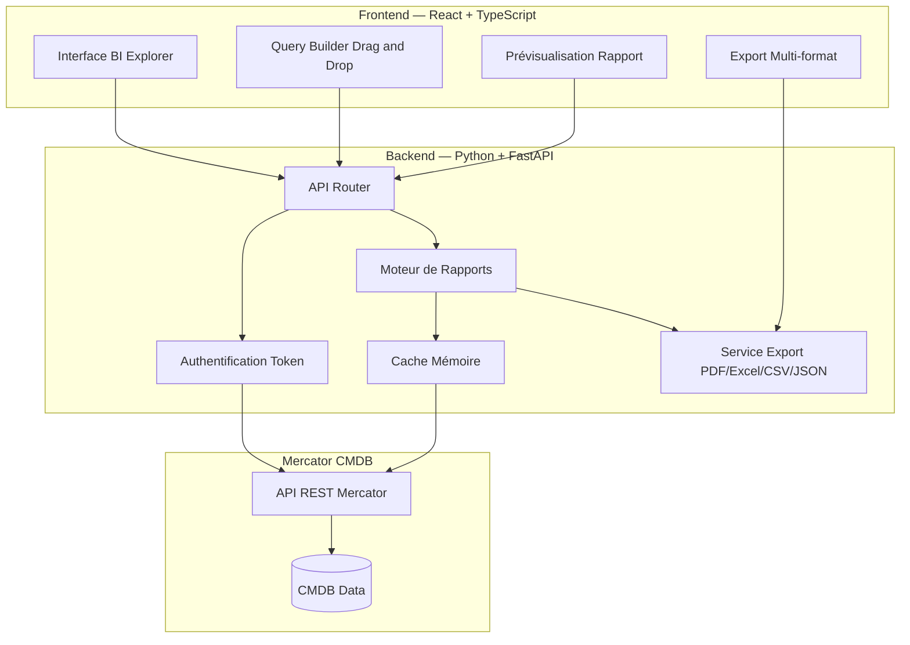

# PRD — Reporting Intelligent pour Mercator CMDB
**Version 3.0 — Phases 1 & 2 Terminées**

---

## 1. Résumé Exécutif

**Objectif Business :** Fournir un outil intelligent de reporting utilisant les API de Mercator CMDB pour permettre aux utilisateurs de créer, personnaliser et exporter leurs propres rapports sans dépendre de l'équipe de développement.

**Vision :** Recréer l'approche flexible de reporting qui faisait le succès d'Isiparc dans les années 2000, en adaptant cette philosophie aux technologies modernes et aux besoins actuels de gestion de CMDB.

**Références :**
- Mercator GitHub : https://github.com/dbarzin/mercator
- Mercator Documentation : https://dbarzin.github.io/mercator/
- Mercator APIs : https://dbarzin.github.io/mercator/api/
- Mercator Data Model : https://dbarzin.github.io/mercator/model/

---

## 2. Historique et Contexte

### 2.1 Contexte Historique
Dans les années 2000, il existait des logiciels de gestion de parc micro-informatique. Entre autres, il existait un outil standard et un autre qui se nommait **Isiparc** de la société **Isilog**.

Ce logiciel avait la particularité d'avoir un modèle de données extrêmement bien fait, qui permettait de gérer n'importe quel parc, que ce soit des PCs ou des bâtiments.

### 2.2 L'Approche Isiparc pour le Reporting
Un des avantages majeurs de ce logiciel était l'approche pour le reporting :
- **Pas de rapports intégrés directement dans l'outil**
- **Fourniture d'une interface pour Cognos Impromptu**
- **Permettait aux utilisateurs de réaliser leurs propres rapports** selon leurs besoins spécifiques

### 2.3 Cognos Impromptu — Référence Technique
**Cognos Impromptu** était un outil de requêtage et de reporting d'IBM qui permettait :
- La création de requêtes sans connaissance SQL approfondie
- La génération de rapports personnalisés via une interface graphique
- L'export vers de multiples formats (PDF, Excel, HTML)
- La connexion à diverses sources de données via des catalogues métier

**Leçon Apprise :** Cette approche "self-service" donnait l'autonomie aux utilisateurs finaux tout en réduisant la charge sur les équipes techniques.

---

## 3. Objectifs du Projet

### 3.1 Objectifs Principaux

| Objectif | Description | Priorité |
|----------|-------------|----------|
| Autonomie utilisateur | Permettre aux utilisateurs de créer leurs rapports sans développeur | Haute |
| Flexibilité | Adapter les rapports à tous types de besoins métier | Haute |
| Pérennité | Possibilité de sauvegarder les requêtes et templates de rapports | Haute |
| Performance | Temps de génération de rapports < 30 secondes | Moyenne |
| Sécurité | Respect des rôles et permissions CMDB | Haute |
| Export multi-format | PDF, Excel, CSV, JSON | Moyenne |

### 3.2 Périmètre

**Inclus (MVP) :**
- Connexion aux API Mercator CMDB
- Interface de création de rapports self-service
- Gestion des modèles de rapports prédéfinis
- Export et planification de rapports
- Gestion des droits d'accès

**Exclus :**
- Modification des données de la CMDB
- Administration de la CMDB elle-même
- Intégration avec d'autres systèmes (phase 2)

---

## 4. Architecture Technique

### 4.1 Schéma d'Architecture en Couches

```
+-------------------------------------------------------------+
|                    Couche Présentation                       |
|  +-----------------------------------------------------+    |
|  |          Frontend React + TypeScript                |    |
|  |   (BI Explorer / Cognos Impromptu moderne)         |    |
|  +-----------------------------------------------------+    |
+-------------------------------------------------------------+
                              |
                              v
+-------------------------------------------------------------+
|                    Couche Métier                             |
|  +-------------+  +-------------+  +-------------------+   |
|  |  Moteur de  |  |  Gestion    |  |   Planification   |   |
|  |  Rapports   |  |  des Droits |  |   des Exports     |   |
|  +-------------+  +-------------+  +-------------------+   |
|         Backend Python + FastAPI                             |
+-------------------------------------------------------------+
                              |
                              v
+-------------------------------------------------------------+
|                    Couche Données                            |
|  +-------------+  +-------------+  +-------------------+   |
|  |  Mercator   |  |   Cache     |  |   Logs & Audit    |   |
|  |  CMDB API   |  |  (mémoire)  |  |                   |   |
|  +-------------+  +-------------+  +-------------------+   |
+-------------------------------------------------------------+
```

### 4.2 Schéma Mermaid — Architecture Applicative



### 4.3 Stack Technique

| Couche | Technologie | Justification |
|--------|-------------|---------------|
| Frontend | React + TypeScript | Moderne, maintenable, écosystème riche |
| Backend | Python + FastAPI | Stack décidée, bonnes bibliothèques API |
| Données | API Mercator + Cache mémoire | Pas de base additionnelle au MVP |
| Export | openpyxl + reportlab | PDF et Excel natif Python |
| Authentification | Token API Mercator (user/password) | Respect des rôles CMDB existants |
| Containerisation | Docker + Docker Compose | Déploiement simplifié |
| Gestion paquets | uv + pyproject.toml | Moderne, pas de requirements.txt |

**Routes** `/api/mercator/*` : Couche de proxy interne utilisée pendant le développement pour tester et valider les données Mercator (debug, healthcheck Docker). En production `(DEBUG=false)`, ces routes sont désactivées — seules les routes `/api/reports/*` sont exposées au frontend.


> **Décision MVP :** Pas de base de données additionnelle (ni PostgreSQL, ni Redis). On s'appuie exclusivement sur le cache mémoire et les appels API Mercator.


---

## 5. Arborescence du Projet

### 5.1 Arborescence locale (host)

```
mercator_reporting/                    ← racine du projet
│
├── src/                               ← code source Python
│   ├── __init__.py
│   ├── config.py                      ← Settings pydantic (URL, login, password, cache TTL)
│   ├── main.py                        ← FastAPI app, routers, CORS, logging
│   │
│   ├── api/
│   │   ├── __init__.py
│   │   └── routes/
│   │       ├── __init__.py
│   │       └── mercator.py            ← GET /api/mercator/* (list, detail, export JSON)  ✅ Phase 2
│   │
│   ├── core/
│   │   ├── __init__.py
│   │   ├── mercator_client.py         ← Client HTTP (auth Bearer, cache TTL, retry x3)  ✅ Phase 2
│   │   └── dependencies.py            ← Injection FastAPI (singleton MercatorClient)    ✅ Phase 2
│   │
│   ├── models/         __init__.py    ← (stub — Phase 3 : modèles Pydantic)
│   ├── reporting/      __init__.py    ← (stub — Phase 3 : ReportEngine)
│   └── services/       __init__.py    ← (stub — Phase 3 : ExportService)
│
├── tests/
│   ├── __init__.py
│   ├── conftest.py                    ← Fixtures + mocks (données réelles dump_standard.json) ✅ Phase 2
│   ├── test_phase1_api.py             ← 35 tests routes HTTP — US2                           ✅ Phase 2
│   ├── test_phase1_mercator_client.py ← 23 tests unitaires MercatorClient (auth, cache, retry) ✅ Phase 2
│   ├── test_phase2_filters.py         ← (stub — Phase 3)
│   ├── test_phase2_query.py           ← (stub — Phase 3)
│   └── run_tests.sh                   ← Raccourcis pytest par phase
│
├── docs/
│   ├── sources/
│   │   ├── mercator_backup_dump_v4.py ← Script de dump API Mercator (référence)
│   │   └── dump_standard.json         ← Données de référence (50 endpoints, 34 actifs)
│   └── ANNEXE_A_mapping_mercator.md   ← Mapping complet endpoints/champs/relations  ✅ Phase 1
│
├── storage/                           ← Rapports exportés (monté comme volume Docker)
│   ├── reports/
│   └── templates/
│
├── scripts/                           ← Scripts utilitaires (monté comme volume Docker)
│
├── pytest.ini                         ← Config pytest (markers phase1/phase2/integration)
├── docker-compose.yml                 ✅ Phase 1
├── Dockerfile                         ✅ Phase 1
├── pyproject.toml                     ✅ Phase 1 (corrigé : sans doublons, sans PostgreSQL)
├── bootstrap.sh                       ✅ Phase 1 (setup local + docker)
├── .env.example                       ✅ Phase 1
└── README.md
```

### 5.2 Arborescence dans le container Docker

```
/                                      ← Système python:3.11-slim
├── bin/
│   ├── uv                             ← Gestionnaire de paquets (copié depuis image Astral)
│   └── uvx
│
├── usr/
│   ├── bin/gcc  curl                  ← Dépendances système (apt)
│   └── local/
│       └── lib/python3.11/
│           └── site-packages/         ← Dépendances installées par uv pip install -e .
│               ├── fastapi/
│               ├── uvicorn/
│               ├── httpx/
│               ├── tenacity/
│               ├── pydantic_settings/
│               ├── openpyxl/
│               ├── reportlab/
│               └── ...
│
└── app/                               ← WORKDIR (répertoire de travail)
    ├── pyproject.toml                 ← Copié au build (layer cache Docker)
    ├── README.md
    │
    ├── src/                           ← Copié au build + monté en volume (hot reload dev)
    │   ├── config.py
    │   ├── main.py
    │   ├── api/routes/mercator.py
    │   ├── core/mercator_client.py
    │   └── core/dependencies.py
    │
    ├── scripts/                       ← Monté en volume depuis ./scripts/
    │
    └── storage/                       ← VOLUME persistant → monté depuis ./storage/
        ├── reports/                   ← Rapports exportés sauvegardés
        └── templates/                 ← Templates de rapports

```

**Ports exposés :** `8000` (FastAPI/uvicorn)

**Variables d'environnement injectées par docker-compose :**

| Variable | Défaut | Rôle |
|----------|--------|------|
| `MERCATOR_BASE_URL` | `http://host.docker.internal:8080` | URL Mercator (host.docker.internal = machine hôte) |
| `MERCATOR_LOGIN` | `admin@admin.com` | Login Mercator |
| `MERCATOR_PASSWORD` | `password` | Mot de passe Mercator |
| `DEBUG` | `false` | Mode debug FastAPI |
| `SECRET_KEY` | `change-me-in-production` | Clé de signature JWT |
| `MAX_EXPORT_ROWS` | `10000` | Limite lignes export |

---

## 6. User Stories & Critères d'Acceptance

### US1 — Proposition d'Architecture et Solution (Conception)
**En tant que** Responsable Produit Mercator
**Je veux** disposer d'une approche innovante et documentée pour le reporting
**Afin de** guider le développement de façon claire et autonome

**Critères d'acceptance :**
- [x] Solution proposée et validée
- [x] Critères définis et mesurables
- [x] Instructions de développement rédigées
- [x] Instructions de tests rédigées
- [x] Schéma d'architecture Mermaid présent
- [x] Stratégie agile avec étapes définies
- [x] Document complet en Markdown livré

---

### US2 — Appel des Endpoints Mercator
**En tant que** Product Owner de la base Mercator CMDB
**Je veux** consulter chaque asset par catégorie en m'appuyant sur les API Mercator
**Afin de** valider les entrées et connaître les assets et leurs liens

**Critères d'acceptance :**
- [x] Liste filtrable de tous les équipements par catégorie
- [x] Détails des informations par équipement
- [x] Export des données en JSON
- [x] Mise à jour en temps réel depuis la CMDB

> **Notes techniques :** Le script `docs/sources/mercator_backup_dump_v4.py` est un exemple de collecte via API. Le fichier `docs/sources/dump_standard.json` est un exemple de résultat.

---

### US3 — Inventaire et Configuration
**En tant que** Gestionnaire de parc informatique
**Je veux** consulter l'inventaire complet des équipements et de leurs liens
**Afin de** connaître l'état du parc et ses configurations

**Critères d'acceptance :**
- [ ] Liste filtrable de tous les équipements
- [ ] Détails de configuration par équipement
- [ ] Export des données en Excel / CSV / JSON
- [ ] Mise à jour en temps réel depuis la CMDB

---

### US4 — Reporting Intelligent Self-Service
**En tant que** Utilisateur métier ou Gestionnaire de CMDB
**Je veux** créer mes propres rapports basés sur des retours d'expérience
**Afin de** répondre à mes besoins spécifiques sans dépendre du développement

**Critères d'acceptance :**
- [ ] Interface de création de rapports intuitive (style Cognos Impromptu moderne)
- [ ] Bibliothèque de modèles de rapports prédéfinis
- [ ] Glisser-déposer pour construire les requêtes
- [ ] Prévisualisation avant export
- [ ] Sauvegarde des rapports personnalisés
- [ ] Partage de rapports avec autres utilisateurs autorisés

---

### Backlog Phase 2 — User Stories Métier Avancées

> Ces US sont hors périmètre MVP. Elles constituent le backlog de la Phase 2 à planifier après validation du MVP.

#### US5.1 — BIA — Besoins de Sécurité
**En tant que** RSSI
**Je veux** lister les activités et applications avec leurs besoins de sécurité
**Afin de** définir les RTO et RPO par service

**Critères d'acceptance :**
- [ ] Tableau des RTO/RPO par application
- [ ] Classification des niveaux de criticité
- [ ] Export pour documentation de continuité

#### US5.2 — Impacts sur la Continuité d'Activité
**En tant que** Responsable Continuité
**Je veux** mesurer les conséquences d'une interruption de service
**Afin de** prioriser les plans de reprise

**Critères d'acceptance :**
- [ ] Calcul d'impact financier par heure d'indisponibilité
- [ ] Cartographie des dépendances entre services
- [ ] Rapports d'impact visuels (graphiques)

#### US5.3 — CVE (Common Vulnerabilities and Exposures)
**En tant que** Analyste Sécurité
**Je veux** trouver les CVE correspondantes aux applications
**Afin de** identifier les vulnérabilités connues

**Critères d'acceptance :**
- [ ] Recherche de CVE en fonction du CPE des applications
- [ ] Intégration avec bases CVE (NVD, MITRE)
- [ ] Alertes sur les vulnérabilités critiques
- [ ] Historique des vulnérabilités par équipement

#### US5.4 — RGPD et Conformité

**US5.4.1 — Registres des Traitements**
**En tant que** DPO :
- [ ] Liste complète des traitements de données
- [ ] Association traitements / applications / bases de données
- [ ] Export pour documentation légale

**US5.4.2 — Liste des Traitements**
**En tant que** Responsable de traitement :
- [ ] Mapping données sensibles par application
- [ ] Durées de conservation configurables
- [ ] Rapports de conformité RGPD

---

## 7. Plan d'Implémentation Agile

### Phase 1 — Analyse & Conception ✅ TERMINÉE
```
├── Audit des API Mercator CMDB disponibles
├── Mapping des données et modèle conceptuel  →  ANNEXE_A_mapping_mercator.md
├── Validation des user stories avec stakeholders
├── Architecture technique détaillée  →  PRD v2.0
└── Mise en place environnement de développement
```
**Livrable :** PRD consolidé v2.0 + Annexe A mapping + pyproject.toml + Dockerfile + docker-compose + bootstrap.sh

---

### Phase 2 — Socle Technique ✅ TERMINÉE
```
├── Mise en place du projet Python (uv + pyproject.toml)  ✅
├── MercatorClient (auth Bearer, cache TTL, retry x3)     ✅  src/core/mercator_client.py
├── Routes FastAPI /api/mercator/*                        ✅  src/api/routes/mercator.py
├── Injection de dépendances (singleton)                  ✅  src/core/dependencies.py
├── 58 tests unitaires + HTTP (pytest)                    ✅  tests/test_phase1_*.py
└── Dockerisation de l'application                        ✅  Dockerfile + docker-compose.yml
```
**Livrable :** Backend opérationnel, 5 routes API Mercator fonctionnelles, 58 tests (US2 couvert)

**Commandes de test rapide (curl) :**
```bash
# 1. Health check application
curl http://localhost:8000/health

# 2. Health check connexion Mercator
curl http://localhost:8000/api/mercator/health

# 3. Liste des endpoints disponibles
curl http://localhost:8000/api/mercator/endpoints

# 4. Liste des applications (avec pagination)
curl "http://localhost:8000/api/mercator/applications?limit=10&offset=0"

# 5. Filtrage par nom
curl "http://localhost:8000/api/mercator/applications?search=SAP"

# 6. Détail d'une application avec ses relations
curl "http://localhost:8000/api/mercator/applications/1"

# 7. Export JSON complet d'un endpoint
curl "http://localhost:8000/api/mercator/activities/export/json"

# 8. Activités avec champs BIA (RTO/RPO)
curl "http://localhost:8000/api/mercator/activities/export/json" | python3 -m json.tool
```

**Commandes pytest :**
```bash
# Tests Phase 2 uniquement
uv run pytest -m phase1 -v

# Tests du client Mercator (unitaires, sans réseau)
uv run pytest tests/test_phase1_mercator_client.py -v

# Tests des routes HTTP
uv run pytest tests/test_phase1_api.py -v

# Couverture complète
uv run pytest --cov=src --cov-report=term-missing
```

**Note** : Les routes `/api/mercator/*` livrées en Phase 2 sont des routes de développement/debug. Elles seront conditionnées à `DEBUG=true` avant la mise en production (Phase 5).

---

### Phase 3 — Core Reporting (Semaine 5-8)
```
├── Moteur de requêtes dynamiques (ReportEngine)
├── Interface frontend React (BI Explorer)
├── Query Builder avec drag & drop
├── Templates de rapports prédéfinis
└── Fonctionnalités d'export (PDF, Excel, CSV, JSON)
```
**Livrable :** Interface self-service fonctionnelle (US3, US4)

**Instructions de test Phase 3 :**
```bash
pytest tests/test_phase2_filters.py -v
pytest tests/test_phase2_query.py -v
```

---

### Phase 4 — Optimisation & Qualité (Semaine 9-10)
```
├── Optimisation des performances (cache mémoire)
├── Sauvegarde et partage des rapports personnalisés
├── Tests de charge (rapports < 30 secondes)
├── Tests d'acceptance complets (US1 à US4)
└── Documentation utilisateur et technique
```
**Livrable :** Application stable, performances validées

---

### Phase 5 — Déploiement (Semaine 11-12)
```
├── Tests d'acceptance finaux
├── Documentation complète
├── Formation des administrateurs
└── Déploiement en production (Docker Compose)
```
**Livrable :** Application en production

---

## 8. Critères de Succès

### 8.1 Métriques de Performance

| Métrique | Cible | Mesure |
|----------|-------|--------|
| Temps de génération de rapport | < 30 secondes | Moyenne sur 100 requêtes |
| Disponibilité du service | 99.5% | Uptime mensuel |
| Satisfaction utilisateur | > 8/10 | Enquête trimestrielle |
| Adoption | > 60% des utilisateurs cibles | Taux d'utilisation mensuel |

### 8.2 Critères de Qualité

- [ ] 100% des user stories MVP implémentées et testées
- [ ] Couverture de tests Pytest > 80%
- [ ] Aucun bug critique en production
- [ ] Documentation complète disponible
- [ ] Testable avec curl et pytest

---

## 9. Risques et Mitigations

| Risque | Probabilité | Impact | Mitigation |
|--------|-------------|--------|------------|
| API Mercator limitées ou non documentées | Moyenne | Élevé | Prototype précoce, contact éditeur, s'appuyer sur dump_standard.json |
| Performance sur gros volumes | Moyenne | Moyen | Cache mémoire, pagination, requêtes optimisées |
| Adoption utilisateur faible | Moyenne | Élevé | UX soignée (Cognos-like), formation, support dédié |
| Évolution des besoins RGPD (Phase 2) | Faible | Moyen | Architecture extensible, veille réglementaire |
| Ressources insuffisantes | Moyenne | Moyen | Priorisation MVP stricte, phasage clair |

---

## 10. Gouvernance et Suivi

### 10.1 Parties Prenantes

| Rôle | Nom | Responsabilités |
|------|-----|-----------------|
| Product Owner | [À définir] | Priorisation, validation US |
| Chef de Projet | [À définir] | Planning, coordination |
| Lead Tech | [À définir] | Architecture, code review |
| RSSI | [À définir] | Validation sécurité |
| DPO | [À définir] | Validation conformité RGPD (Phase 2) |
| Utilisateurs clés | [À définir] | Tests, feedback |

### 10.2 Rythme de Suivi

- **Daily :** Équipe de développement (15 min)
- **Hebdomadaire :** Point avec Product Owner (30 min)
- **Bi-mensuel :** Comité de pilotage (1h)
- **Mensuel :** Démo aux stakeholders (1h)

---

## 11. Annexes

### 11.1 Glossaire

| Terme | Définition |
|-------|------------|
| CMDB | Configuration Management Database |
| BIA | Business Impact Analysis |
| RTO | Recovery Time Objective |
| RPO | Recovery Point Objective |
| CVE | Common Vulnerabilities and Exposures |
| CPE | Common Platform Enumeration |
| RGPD | Règlement Général sur la Protection des Données |
| BI | Business Intelligence |

### 11.2 Documents Annexes

| Annexe | Fichier | Description |
|--------|---------|-------------|
| Annexe A | `ANNEXE_A_mapping_mercator.md` | Mapping complet des données Mercator CMDB : endpoints, champs, relations, champs BIA/CIAT, graphe de dépendances et recommandations de jointures pour le ReportEngine |

### 11.3 Références

- Documentation API Mercator CMDB : https://dbarzin.github.io/mercator/api/
- Modèle de données Mercator : https://dbarzin.github.io/mercator/model/
- Standard ISO 22301 (Continuité d'activité)
- Règlement RGPD (UE 2016/679)
- Base NVD pour les CVE : https://nvd.nist.gov/
- Archives historiques Isiparc / Isilog (référence conceptuelle)

---

## 12. Historique des Versions

| Version | Date | Auteur | Modifications |
|---------|------|--------|---------------|
| 1.0 | [Date] | [Nom] | Version initiale |
| 1.1 | [Date] | [Nom] | Ajout section Cognos Impromptu |
| 1.2 | [Date] | [Nom] | Complétion user stories et plan d'implémentation |
| 2.0 | Mars 2026 | Claude | Consolidation PRD_review : architecture, risques, gouvernance, glossaire, backlog Phase 2 |
| 3.0 | Mars 2026 | Claude | Phases 1 & 2 terminées : arborescences host + Docker, livrables réels, commandes curl, US1/US2 cochées |

---

**Document approuvé par :**

| Rôle | Nom | Signature | Date |
|------|-----|-----------|------|
| Product Owner | | | |
| Directeur Technique | | | |
| RSSI | | | |

---

> **Note :** Ce PRD est un document vivant qui évoluera en fonction des retours des utilisateurs et des contraintes techniques rencontrées lors de l'implémentation. Toute modification significative devra être validée par le comité de pilotage.